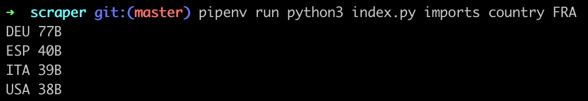
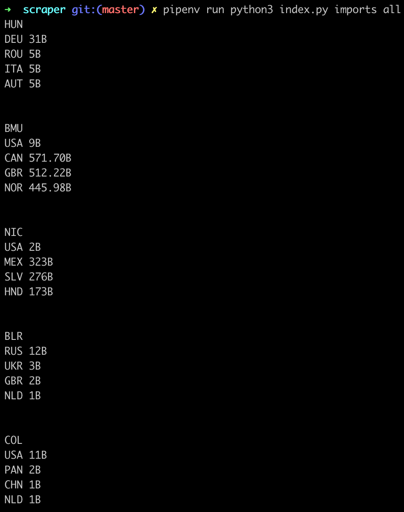

# Scraper

Scraper is a school project using selenium to get data out of a website.

## Installation

Python 3 and Pipenv are required in order to run this program.
You also need to download the [Selenium web driver](https://www.seleniumhq.org/download/) in order to launch the script.

### OSX

```bash
brew install python3
```
```bash
brew install pipenv
```

## Usage
```bash
    pipenv run python3 index.py imports country <IsoCOde>
        
        - IsoCode of a country which displays the top 4 countries that received imports of this country.
```
```bash
    pipenv run python3 index.py imports all
        
        - Grab 5 country randomly and then display the top 4 countries that received imports for all this 5 countries.
```
```bash
    pipenv run python3 index.py imports all --save

        - Save which will then save the contents into a CSV file.
```

## Example

<p align="center">
    
    
</p>

## Executable

If you want to build a cross-platform executable, you need to execute the following bash commands :

```bash
cd scraper
pipenv install
pipenv run pyinstaller index.py --onefile
```

The executable file will be located on the generated dist folder.

## License

[GNU General Public License v3.0](https://www.gnu.org/licenses/gpl-3.0.en.html)